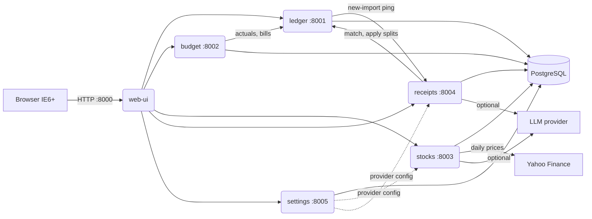

# Architecture

SakuraFinancial is a set of small FastAPI services behind one server-rendered
web UI, deployed together with docker-compose. The web UI is the only thing a
browser ever talks to; services talk to each other over the internal Docker
network.

## Why these seams

- **ledger** owns money movement: accounts, transactions/splits, transfers,
  bills, CSV import. Everything else derives from it.
- **budget** is pure derived state (envelopes, waterfall, deficits) computed
  from ledger data plus its own budget/goal tables — it never writes to ledger.
  Its stored intent is a set of *change points*: a budget entered once applies
  to every later month until superseded, so months nobody opened still have
  real envelopes that track deficits.
- **stocks** is isolated because it has the only scheduled job (daily price
  fetch) and the only mandatory outbound network dependency.
- **receipts** stores original documents forever and only *links* to ledger
  transactions; applying a receipt split is an explicit call to ledger that
  re-divides one transaction's total across categories (never new transactions).
- **settings** exists so every credential and provider choice can be changed
  from the UI at runtime; services read it per-call, so there is nothing to
  restart.

## One importer, two owners

Bank statements are parsed and stored by **ledger**; broker activity by
**stocks**. That split is an implementation detail of ours, not something the
user should have to think about, so the web UI presents a single Import
section: one profile list, one upload form, one review flow. A profile's
*kind* (`bank` or `stock`) decides which service handles the file, and the UI
namespaces ids as `bank:3` / `stock:1` because the two services number their
rows independently.

Both sides share `sakura_common.csvengine` and the same guarantees: the whole
file is validated before anything is written, and a row counts as a duplicate
only when *that account has already imported it* — never because the file
repeats itself.

## Cash across the bank/broker seam

Money moves between a checking account (ledger) and a brokerage (stocks) all
the time, and neither service can write the other's row. The alternatives were
worse than the seam: a category for "money sent to Fidelity" would sit in every
spending report and budget envelope forever, and mirroring investment accounts
as ledger accounts would count their cash twice, since the net-worth report
already adds the ledger's balances to the stocks valuation.

So one movement is two rows, written by the web UI the way it already drives
two importers from one review screen:

| side | row | carries |
| ---- | --- | ------- |
| ledger | one categoryless `kind='transfer'` leg against the bank account | `external_account="stock:1"` |
| stocks | the matching `deposit` / `withdraw` | `external_account="bank:3"` |

Both carry the same `transfer_group_id`, which is how either side finds (and
deletes) the other. The leg is a transfer like any other, so cash-flow and
spending reports skip it; net worth is right because each service reports only
the money it holds.

The ledger leg is written first, because it is the one with an id we can undo:
if the stocks call then fails, that leg is deleted and nothing is left behind.
If the compensating delete fails too, the user is told which transaction to
remove by hand — half a transfer is worth shouting about. Either end can start
the transfer (the register's transfer form, or the stock account page) and
deleting either row removes the other.

### Imports cross the same seam

A transfer rule can name an investment account, so the monthly wire to a
brokerage imports as a transfer rather than as invented spending. Committing the
batch is one ledger transaction, so the ledger writes its legs and returns the
settlements still to make (`external_transfers` in the commit summary); the web
UI books each one in the stocks service immediately afterwards. A leg the stocks
service refuses is deleted again — along with the import row's claim on it, so
re-uploading that statement offers the row afresh — and the summary page says
which rows were dropped and why. The ledger never calls the stocks service
itself; the same rule as elsewhere.

Both statements of one movement usually get imported eventually, so each
importer recognises the other's work:

- the **bank** importer flags a row as `counterpart` when a transfer of that
  amount, to that same investment account, is already recorded within the rule's
  window (it was entered by hand, or imported before),
- the **broker** importer flags a `deposit`/`withdraw` as `counterpart` when it
  matches a cash row that carries an `external_account` — money a bank import
  already moved in. A deposit nobody linked is left alone, because nothing says
  the imported row is that one. Its window is `transfer_match_days` in the
  profile config, 5 days by default.

## Editing in bulk

Two screens exist so a year of imported rows never has to be filed one at a
time: the import review page answers *per distinct description* and can be
re-scanned mid-review when a new alias is written, and **Search** filters the
register and applies one category/payee/status to everything ticked. Bulk
recategorizing refuses to touch a split transaction or a transfer and reports
what it left alone, rather than guessing which category was meant and quietly
destroying how the money was divided.

## Data ownership

One PostgreSQL container, one database and one DB user per service
(`infra/postgres-init/`). No service can read another's tables — cross-service
data access is HTTP APIs only. This was a deliberate middle ground (the
"debatable constraint" in the original requirements): microservice isolation
with a single thing to back up.

## Conventions every service follows

- `GET /health` — liveness for compose healthchecks.
- `GET /api/export` → human-readable JSON of the service's entire database;
  `POST /api/import` → restore from that JSON; `POST /api/reset` → erase it
  and come back up as a fresh install (see `docs/runbook.md`). The web UI's
  reset flow refuses to call `/api/reset` until it has built a backup and the
  user has actually downloaded it.
- Amounts are `Decimal` serialized as strings; dates are ISO `YYYY-MM-DD`.
- Errors are FastAPI JSON errors; the web UI translates them into friendly
  HTML pages.
- Optional externals (LLM, Yahoo) degrade gracefully: the feature explains
  what's missing instead of breaking the page.

## The IE6 constraint

The frontend renders every page on the server (Jinja2). No JavaScript is
required anywhere; charts are matplotlib PNGs served by web-ui itself. See
`docs/ie6-style-guide.md` for the full ruleset and the intentional Win98-era
visual style.
