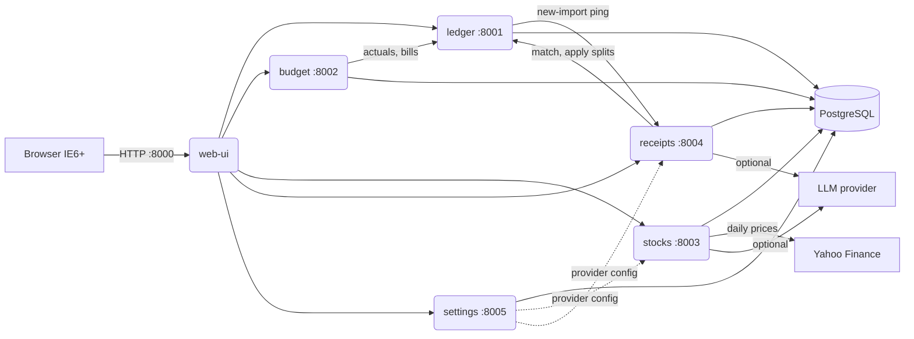

# Architecture

SakuraFinancial is a set of small FastAPI services behind one server-rendered
web UI, deployed together with docker-compose. The web UI is the only thing a
browser ever talks to; services talk to each other over the internal Docker
network.

## Why these seams

- **ledger** owns money movement: accounts, transactions/splits, transfers,
  bills, CSV import. Everything else derives from it.
- **budget** is pure derived state (envelopes, waterfall, deficits) computed
  from ledger data plus its own budget/goal tables — it never writes to ledger.
  Its stored intent is a set of *change points*: a budget entered once applies
  to every later month until superseded, so months nobody opened still have
  real envelopes that track deficits.
- **stocks** is isolated because it has the only scheduled job (daily price
  fetch) and the only mandatory outbound network dependency.
- **receipts** stores original documents forever and only *links* to ledger
  transactions; applying a receipt split is an explicit call to ledger that
  re-divides one transaction's total across categories (never new transactions).
- **settings** exists so every credential and provider choice can be changed
  from the UI at runtime; services read it per-call, so there is nothing to
  restart.

## One importer, two owners

Bank statements are parsed and stored by **ledger**; broker activity by
**stocks**. That split is an implementation detail of ours, not something the
user should have to think about, so the web UI presents a single Import
section: one profile list, one upload form, one review flow. A profile's
*kind* (`bank` or `stock`) decides which service handles the file, and the UI
namespaces ids as `bank:3` / `stock:1` because the two services number their
rows independently.

Both sides share `sakura_common.csvengine` and the same guarantees: the whole
file is validated before anything is written, and a row counts as a duplicate
only when *that account has already imported it* — never because the file
repeats itself.

## Data ownership

One PostgreSQL container, one database and one DB user per service
(`infra/postgres-init/`). No service can read another's tables — cross-service
data access is HTTP APIs only. This was a deliberate middle ground (the
"debatable constraint" in the original requirements): microservice isolation
with a single thing to back up.

## Conventions every service follows

- `GET /health` — liveness for compose healthchecks.
- `GET /api/export` → human-readable JSON of the service's entire database;
  `POST /api/import` → restore from that JSON; `POST /api/reset` → erase it
  and come back up as a fresh install (see `docs/runbook.md`). The web UI's
  reset flow refuses to call `/api/reset` until it has built a backup and the
  user has actually downloaded it.
- Amounts are `Decimal` serialized as strings; dates are ISO `YYYY-MM-DD`.
- Errors are FastAPI JSON errors; the web UI translates them into friendly
  HTML pages.
- Optional externals (LLM, Yahoo) degrade gracefully: the feature explains
  what's missing instead of breaking the page.

## The IE6 constraint

The frontend renders every page on the server (Jinja2). No JavaScript is
required anywhere; charts are matplotlib PNGs served by web-ui itself. See
`docs/ie6-style-guide.md` for the full ruleset and the intentional Win98-era
visual style.
